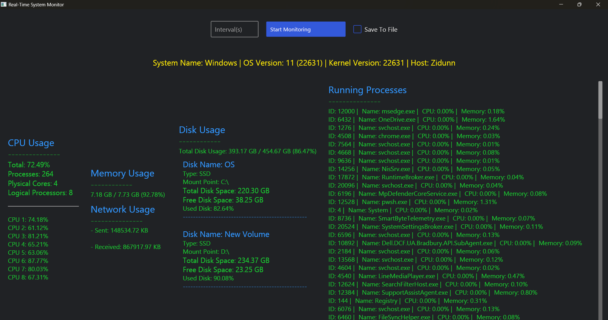
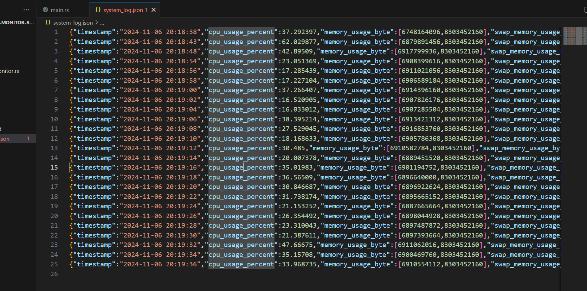

# Real-time System Monitor

Rust System Monitor is a real-time system monitoring application built with Rust and the Iced GUI framework. It tracks essential system metrics, including CPU usage, memory consumption, disk usage, and network traffic, and allows users to log data for further analysis.

## Grup Members and Contributions

1. **Saw Zi Dunn** - Data Structures Implementations, System Data Retrieval
2. **San Aung** - GUI Design and utility functions

## Features

-   **Real-time System Metrics**: Track CPU, memory, disk, and network usage.
-   **Customizable Data-logging Interval**: Set time intervals for logging data.
-   **Data Logging**: Option to save monitored data to a file for later analysis with set interval.
-   **User-Friendly GUI**: Built with the Iced framework for user interface.

## Demonstration Video

Click [here](https://youtu.be/9txkmWX0i5g?si=g67H7wHb31Vi-JRg) to watch Demonstration Video.

## Screenshots

### Main Dashboard



### Data Logging



## Installation

1. Ensure Rust is installed on your system:

-   **On macOS**: Open your terminal and run:
    ```bash
    curl --proto '=https' --tlsv1.2 -sSf https://sh.rustup.rs | sh
    ```
-   **On Windows**: Download and run the Rust installer from [rustup.rs](https://rustup.rs/). Complete the installation steps, then restart your terminal.

2. Clone this repository:
    ```bash
    git clone https://github.com/SawZiDunn/real-time-sys-monitor-rust.git
    ```
3. Go to the project directory:
    ```bash
    cd real-time-sys-monitor-rust
    ```

## How to Run

1. Build the program:
    ```
    cargo build
    ```
2. Run the program:
    ```bash
    cargo run
    ```

## Dependencies

-   [`sysinfo`](https://crates.io/crates/sysinfo) - For system metrics
-   [`iced`](https://crates.io/crates/iced) - For building the GUI
-   [`serde`](https://crates.io/crates/serde) and [`serde_json`](https://crates.io/crates/serde_json) - For data serialization
-   [`chrono`](https://crates.io/crates/chrono) - For time manipulation

## Project Structure

-   **`main.rs`**: Entry point for the application.
-   **`models.rs`**: Defines data structures and enums representing system information.
-   **`system_monitor.rs`**: Core logic for the GUI and data retrieval.
-   **`utils.rs`**: Utility functions for calculations and data formatting.

### `system_monitor.rs` Highlights

The `system_monitor.rs` file combines GUI elements and data fetching logic:

-   `create_control_row`: Builds the row for controls like interval input, monitoring toggle, and save-to-file checkbox.
-   `view_sys_base_info`, `view_cpu_info`, `view_memory_info`, `view_disk_info`, `view_network_info`, `view_process_info`: Functions that render specific system information.
-   `Application` Implementation: Initializes system data, refreshes on a set interval, and handles user interactions.

## Usage

1. **Start Monitoring**: Set the monitoring interval and toggle "Start Monitoring".
2. **Save Data**: Check "Save to File" to log data to a file at the set interval.
3. **View System Data**: CPU, memory, disk, and network usage display in real-time.
